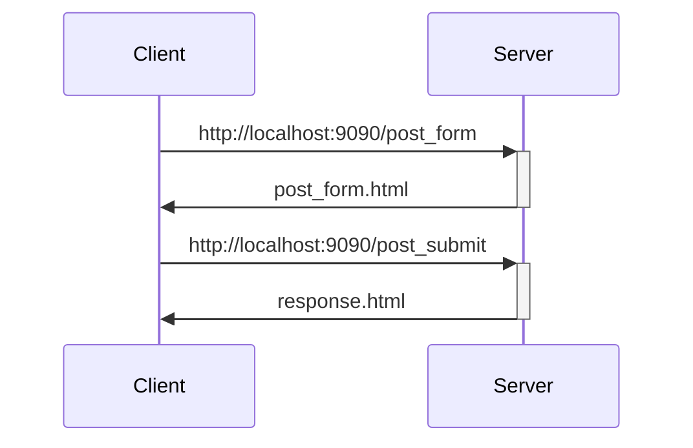

<<<<<<< HEAD
# password-manager

This project is a password manager for the class of Introduction to Software Testing.

## Getting started

1. `make install`
2. `make run`

### Folder structure

- **crypto** (this is the password generator part, along with the encryption/decryption)
- **web** (this is the web part)
    - **accounts** (Holds the database for the accounts and allows the interaction of them)
    - **core** (Holds the rest of the program other than the accounts)
    - **templates** (Holds the HTML)
        - **accounts**
        - **core**
    - **__init__**
- **.env**
- **config.py**
- **manage.py**
- **Dockerfile**
- **README.md**
=======
# flask_ex1
A docker environment for Flask with coding examples

Open a shell and move to the flask_ex1 folder. Under the folder, execute the following commend
```
docker build -t flask_ex1 .
``` 

After build the image, you can check the image by using the following command
```
docker image ls
```
You should see a image flask_ex1.

```
docker run -itd -p9090:9090 --rm -v$(pwd)/app:/src/app --name flask_ex1_con flask_ex1
```

You can check the flask server log by using docker container logs command

```
docker logs flask_ex1_con -f
```

To view the page, 
- First page:
    - http://localhost:9090
- Home page:
    - http://localhost:9090/home
- Home page with control variable cval (cval=1 or 0) sent over HTTP GET method:
    - http://localhost:9090/home?cval=1
    - http://localhost:9090/home?cval=0
    - http://localhost:9090/home (the same as cval=0 because default value = 0)
- Post form page and its response:
    - http://localhost:9090/post_form
    - Response page after post form submission (route is /post_submit)

HTTP Request and Response Flow


Reference of Using "Session" Variables
- https://testdriven.io/blog/flask-sessions/ 


>>>>>>> flask_ex1/main
